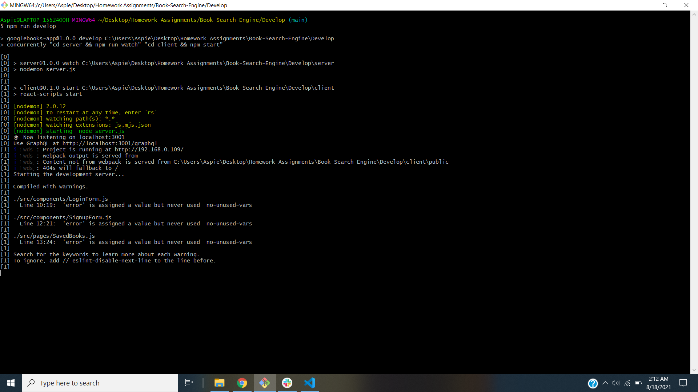

# Book Search Engine: :blue_book::closed_book::computer::green_book::orange_book:

## Table of Contents :books::card_file_box:

1.  [Description](#Description)
2.  [Installation](#Installation)
3.  [Project Usage](#Project-Usage)
4.  [License Information](#License-Information)
5.  [Testing Instructions](#Testing-Instructions)
6.  [Heroku Application Link](#Heroku-Application-Link)
7.  [Contributors](#Project-Contributors)
8.  [Contact Info](#Questions)
9.  [Screenshots](#Screenshots)

 

## Description :open_book::desktop_computer:

This application entails a fully functioning Google Books API search engine built with a RESTful API, which has been refactored to be a GraphQL API built with the Apollo Server. The app was built using the MERN stack with a React front end, MongoDB database, and Node.js/Express.js server and API.

 

## Installation :hammer_and_wrench::gear:

### _Application Dependencies Include_

- Mongoose
- Express
- React (-dom/router-dom/-scripts)
- Node.js
- Apollo-Server
- Apollo-Server-Express
- GraphQL
- Bootstrap
- JWT
- Heroku

## _Files Created & Modifications to Make Front/Back End Functional Included_

### _Client Side Specifications_

1. Mutations.js - Executes the "LOG_IN", "ADD_USER", "SAVE_BOOK" & "REMOVE_BOOK" mutations.
2. Queries.js - Holds the query "GET_ME", which executes the "me" query set up using Apollo Server.
3. App.js - Apollo Provider created to sync with Apollo Server.
4. SearchBooks.js - "useMutation()" Hook executes the "SAVE_BOOK" mutation in the "handleSaveBook()" function, instead of the "saveBook()" function imported from the "API" file.
5. SavedBooks.js - "useQuery()" hook executes the "GET_ME" query on load and saves to variable "userData". Also, "useMutation" hook executes "REMOVE_BOOK" mutation.
6. SignupForm.js - "ADD_USER" mutation functionality is executed.
7. LoginForm.js - "LOGIN_USER" mutation functionality is executed.

### _Server Side Specifications_

1. server.js - Apollo Server is implemented and applied to the Express server as middleware.
2. auth.js - Auth middleware function updated to work with the GraphQL API.
3. Schemas - index.js - typeDefs and resolvers are exported.
4. Schemas - resolvers.js - queries and mutations functionality is defined to coincide with the Mongoose models.
5. Schemas - typeDefs.js - utilizing the apollo-server-express and GraphQL, all queries and mutations are defined here (including Auth function).

### _Additional Install Instructions & Tools Include_

- Run NPM Install to utilize package.json dependencies
- Need to utilize Heroku and MongoDB Atlas to deploy properly.

 

## Project Usage :man_teacher::bookmark_tabs:

_User Story_ 
As an avid reader
I want an application to search for new books to read, so that I can keep a list of books to purchase. I want the ability to save and view these books, and also the option to delete any book which I don't want saved any longer.

 

## License Information :tickets::copyright:

The MIT License is a permissive free software license originating at the Massachusetts Institute of Technology in the late 1980s. As a permissive license, it puts only very limited restriction on reuse and has, therefore, high license compatibility.

 

## Testing Instructions :man_scientist::microscope:

1. Follow the Heroku app link located below.
2. At the top right of the screen, create a new account by signing up with name/email/password. Or if returning, login with current credentials.
3. Utilize the search box to enter in any book of your choosing (or author, title, description) and click "Submit Search".
4. You will see a list of the matching books below the search bar relevant to your search. From here you have the capability to save as many books as you like!
5. After your books are saved, you can click on "See Your Books" to view your selections. From here, you have the capability to delete any book which you have already saved previously.
6. The application runs off of Heroku, while connected to a MongoDB database, so all of your saved books will be saved on local storage in addition to back end server-side storage.
7. Please feel free to clone the repo to test on your local machine. You will need to NPM I for the dependencies (including GraphQL), and make sure you are connected to a MONGODB to run with full intended functionality.

 

## Heroku Application Link :ledger::file_cabinet:

### **https://polar-meadow-78874.herokuapp.com/**

 

## Project Contributor :man_technologist::pen:

Adam Spiegel 
Full Stack Web Developer

 

## Questions? :raising_hand_man::handshake:

### Please find my contact information below to reach out and collaborate!

  

 

## Screenshots - Application Functionality :camera::collision:

 

## _Successful Build_

 

## _Coding Student Book Search Results_

 

## _Parent Book Search Results_

 

## _View Your Saved Book Collection_

 

## _While Browsing, View The Books You Already Saved_

 

## _Local Storage Array of Your Saved Books_

 

## _MongoDB - Backend Book Search Saving Capabilities_

 

